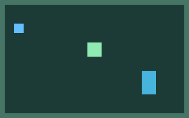

# GE4G / GameEngineForGPT

**0.1 “Basement”** — GPT와 코딩 에이전트가 저장소 파일과 CLI로 제작하고 검증할 수 있는 2D 게임 엔진입니다. GUI 편집기 없이 JSON5 장면을 작성하며, 사람이 플레이하는 창과 헤드리스 실행은 같은 결정론적 시뮬레이션·CPU 렌더러를 사용합니다.

Rust로 구현한 실제 엔진입니다. OpenAI 계정, LLM 호출, GPU, 인터넷 연결은 게임 실행에 필요하지 않습니다. 초기 의존성 다운로드에는 인터넷이 필요합니다.

Basement 0.2 — **FlatLand 0.2.0**: 맵·엔티티 분리, 밀기·방향, 전투/적 AI, 아이템/장비/퀘스트, 평면·높이·카메라·아틀라스 애니메이션, 선택 대화·컷씬·턴제 전투와 Lua 5.4를 구현했습니다. 팩맨 스타일 데모와 **[Signal Yard](examples/flatland_signal_yard/README.md)** 기능 실험장이 함께 제공됩니다. 모바일은 `.ge4g` 불러오기, PC는 실행기를 내장한 배포 방식입니다. Android 0.2.0은 rc.1과 같은 서명으로 업데이트됩니다. [짧은 작성 안내](docs/FLATLAND_QUICKSTART.md) · [실제 작성 규격과 제한](docs/FLATLAND_AUTHORING.md).

## 빠른 시작

안정판 Rust를 [rustup](https://rustup.rs/)으로 설치한 뒤 실행하세요. 기본 창 빌드는 Linux X11, Windows, macOS용 minifb 어댑터를 사용합니다. Linux 창/오디오 빌드에는 ALSA 개발 패키지(`libasound2-dev`, Arch: `alsa-lib`)와 X11 런타임 라이브러리가 필요하며 Wayland에서는 XWayland를 사용할 수 있습니다. CI가 검증하는 플랫폼은 Linux입니다.

```sh
git clone https://github.com/zizonhyeontae218/Game-Engine-For-GPT.git
cd Game-Engine-For-GPT
cargo run --locked -p ge4g-cli -- validate examples/basement_demo
cargo run --locked -p ge4g-cli -- test examples/basement_demo
cargo run --locked -p ge4g-cli -- run examples/basement_demo
```

GitHub Actions의 `ge4g-basement-linux-x86_64` 아티팩트에는 실행 파일과 데모가 함께 들어 있습니다. 압축을 풀고 `ge4g-basement` 폴더에서 `./ge4g run examples/basement_demo`로 실행할 수 있습니다. 직접 패키징하려면 `cargo build --locked --release -p ge4g-cli` 후 `python3 scripts/package.py`를 실행하세요.

창에서 **WASD / 방향키**로 이동하고 **E / Space**로 NPC와 대화합니다. 파란 사각형이 플레이어, 주황색이 NPC, 초록색이 다음 방으로 가는 문입니다. 오른쪽 벽에 부딪힌 뒤 벽 아래로 내려가 NPC에 접근하고 문으로 이동하세요. 대사와 저장 상태는 창 제목에 표시됩니다.

| 키 | 동작 |
| --- | --- |
| F3 | 충돌·트리거 윤곽선 |
| P / N | 일시 정지 / 정지 상태에서 한 틱 진행 |
| F5 / F9 | 상태 저장 / 저장 상태로 재시작 |
| Escape | 종료 |

F5의 기본 저장 위치는 `examples/basement_demo/save.json`입니다. 저장은 선언된 영속 상태값을 보존하며 재시작은 시작 장면에서 이루어집니다. 창 제목의 `NPC:true`, `RoomB:true`로 복원 결과를 확인할 수 있습니다.

## 에이전트·헤드리스 실행

```sh
mkdir -p artifacts
cargo run --locked -p ge4g-cli -- run examples/basement_demo --headless \
  --replay examples/basement_demo/replays/journey.json \
  --trace artifacts/trace.json --snapshot-out artifacts/world.json \
  --save artifacts/save.json --json
cargo run --locked -p ge4g-cli -- inspect examples/basement_demo entity player \
  --snapshot artifacts/world.json --json
cargo run --locked -p ge4g-cli -- run examples/basement_demo --headless \
  --ticks 0 --load artifacts/save.json --json
cargo run --locked -p ge4g-cli -- capture examples/basement_demo \
  --tick 160 --replay examples/basement_demo/replays/journey.json \
  --out artifacts/frame.png --json
```

창 라이브러리까지 제외하려면 `cargo run --locked -p ge4g-cli --no-default-features -- run examples/basement_demo --headless --ticks 60 --json`을 사용하세요.

`validate`, `inspect`, `run`, `capture`, `diagnose`, `test`, `schema`를 제공합니다. `--json`은 결과 또는 오류 하나를 stdout의 JSON 객체로 반환합니다. `schema scene --json` 등으로 현재 JSON Schema를 읽을 수 있습니다.

## 구현 범위

- 60 Hz 고정 틱, 정수 서브픽셀 이동, 안정된 엔티티 순서와 입력 리플레이
- 연속 AABB 검사와 X→Y 충돌 해소, NPC 대화, 문 트리거, 이름으로 선택하는 장면 스폰
- 타입이 선언된 상태 저장소, 버전 검사, 원자적 저장과 오류를 숨기지 않는 불러오기
- CPU RGBA 프레임버퍼, 색상·PNG 텍스처 사각형, 카메라, 레이어, 충돌 윤곽선
- 조회 가능한 상태·컴포넌트·메타데이터와 최대 4,096개 이벤트의 추적
- 프로젝트 정의 체크포인트, 반복 리플레이 비교, 프레임 골든, 저장·캡처 검증

게임 동작은 선언형 컴포넌트로 작성합니다. Lua, 3D, 네트워킹, 일반 물리 엔진, 게임 제작용 GUI 편집기는 이번 버전 범위에 포함하지 않습니다. 오디오는 관찰 가능한 `audio` 이벤트와 무음 어댑터로 제공하며 실제 음원 재생은 구현하지 않았습니다.

참조 리플레이의 160틱 최종 프레임:



## 검증과 문서

```sh
cargo fmt --all --check
cargo clippy --locked --workspace --all-targets -- -D warnings
cargo test --locked --workspace
cargo run --locked -p ge4g-cli -- validate examples/basement_demo
cargo run --locked -p ge4g-cli -- test examples/basement_demo
python3 scripts/filetree.py lint
```

[CLI 계약](docs/CLI_CONTRACT.md), [파일 작성법](docs/AUTHORING.md), [구조](docs/ARCHITECTURE.md), [검증 계획](docs/TESTPLAN.md), [릴리스 기록](docs/RELEASE_NOTES.md)을 참고하세요. `AGENTS.md`와 `F(x).md`는 다음 에이전트를 위한 저장소 내 작업 지침·상태 레지스트리입니다.

자동 검증과 가상 디스플레이 창 실행을 기록했습니다. 실제 사람이 키보드로 플레이하는 최종 수용 테스트와 ILCX™ 인간 기여 평가는 아직 수행되지 않았습니다.

## Flutter client: GE4G / GameEngineForGPT

Android/iOS: install the client → **Import .ge4g** → play. Windows/Arch: each game ships with its complete embedded Flutter client and native Basement runtime and starts directly. Joystick + Z/X/C/Space, digital brutalism, live profile switching/editing and separate per-game JSON bindings are implemented.

See [client usage/build/distribution](docs/CLIENT.md) and [permanent launcher philosophy](docs/LAUNCHER_PHILOSOPHY.md). Download platform bundles from the [GE4G Flutter clients Actions artifacts](https://github.com/zizonhyeontae218/Game-Engine-For-GPT/actions/workflows/client.yml). Android artifacts use a development signing key; iOS artifacts are unsigned.

최종 [플랫폼 빌드·다운로드](https://github.com/zizonhyeontae218/Game-Engine-For-GPT/actions/runs/37022204555): Android APK, Windows 내장 ZIP, Linux 내장 tarball, unsigned iOS ZIP. 네 플랫폼 작업과 전체 엔진 검증이 통과했습니다. 실기기 및 Arch 설치 확인은 별도입니다.

## FlatLand 데모

```sh
cargo run --locked -p ge4g-cli -- run examples/flatland_pacman
cargo run --locked -p ge4g-cli -- test examples/flatland_pacman --json
python3 scripts/pack_game.py examples/flatland_pacman --game-id demo.flatland.pacman --version 0.2.0-alpha.1 --out dist/flatland-pacman.ge4g
```

Flutter 0.2 실행기로 `.ge4g`를 불러오세요. 회전 버튼으로 가로/세로 배치를 선택하며, 대화는 별도 팝업으로 표시됩니다. CC0 스프라이트 출처·라이선스는 데모 `assets/`에 포함됩니다. 0.1 게임도 계속 실행할 수 있습니다.
